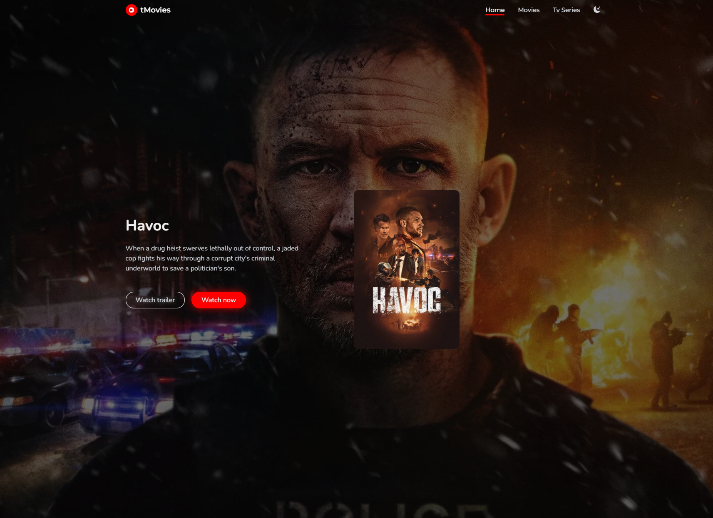
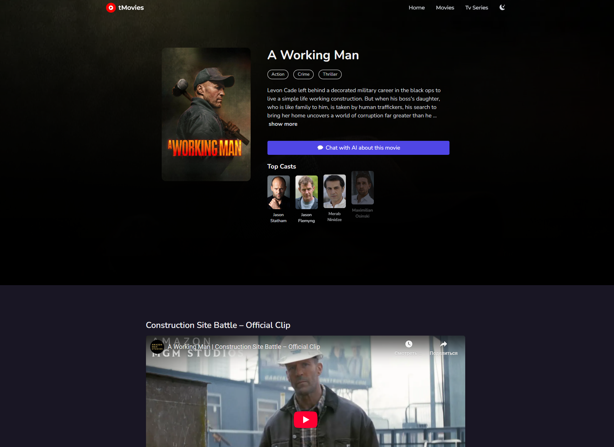
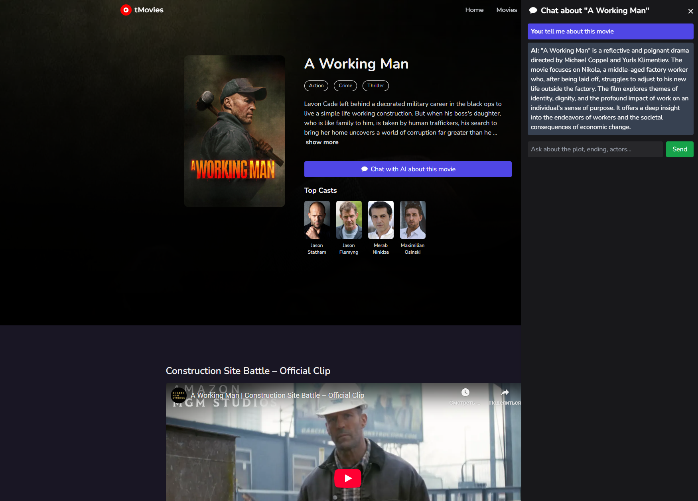

# 🎬 tMovies - AI-Powered Movie App

A clean and responsive movie app built with React, TypeScript, and Tailwind CSS.
Now enhanced with **AI-powered movie chat** using OpenRouter (Mistral 7B).

---

## 🌟 Features

- 🔎 **Search** for movies and TV shows with instant results
- 🎥 **Watch trailers** directly inside the app
- 📋 **Detailed pages** for each title including cast, overview, genres
- 🤖 **AI Movie Chat Assistant** powered by `mistralai/mistral-7b-instruct:free`
  - Ask about plot, actors, and even endings
  - AI responses appear in an interactive chat panel

---

## 🔧 Tech Stack

- React + Vite
- TypeScript
- Tailwind CSS
- TMDB API
- OpenRouter AI API

---

## 🛠 Getting Started

### 1. Clone the Repository

```bash
git clone https://github.com/your-username/your-repo-name.git
cd movie-app
```

### 2. Install Dependencies

```bash
npm install
```

### 3. Set Up Environment Variables

Create a `.env` file in the root:

```env
VITE_TMDB_API_KEY=your_tmdb_api_key
VITE_TMDB_API_BASE_URL=https://api.themoviedb.org/3
VITE_OPENROUTER_API_KEY=your_openrouter_api_key
```

- 🔑 [Get your TMDB API key](https://www.themoviedb.org/settings/api)
- 🔑 [Get your OpenRouter API key](https://openrouter.ai/keys)

### 4. Run the App

```bash
npm run dev
```

Open `http://localhost:3000` in your browser.

---

## 📸 Screenshots

<kbd>
  
</kbd>

<kbd>
  
</kbd>

<kbd>
  
</kbd>

---

## 🤖 How the AI Chat Works

- AI is powered by [OpenRouter](https://openrouter.ai)
- It uses `mistralai/mistral-7b-instruct:free` model
- AI assistant is triggered from the movie detail page
- Context is passed via prompt like: `Movie: "Inception". Question: Who is the director?`

---

## 🤝 Contributing

1. Fork this repo
2. Create a feature branch
3. Commit your changes
4. Push and open a PR

---

## 🧾 License

MIT License. Feel free to use, modify, and distribute.

---

## ✨ Credits

Original design by Tuat Tran Anh. AI integration by [Your Name].
